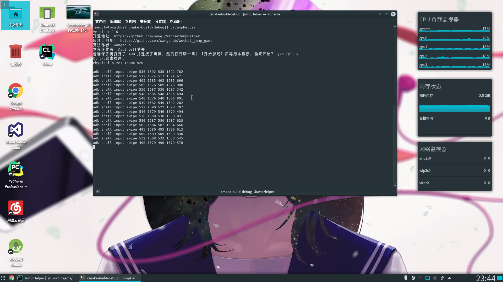
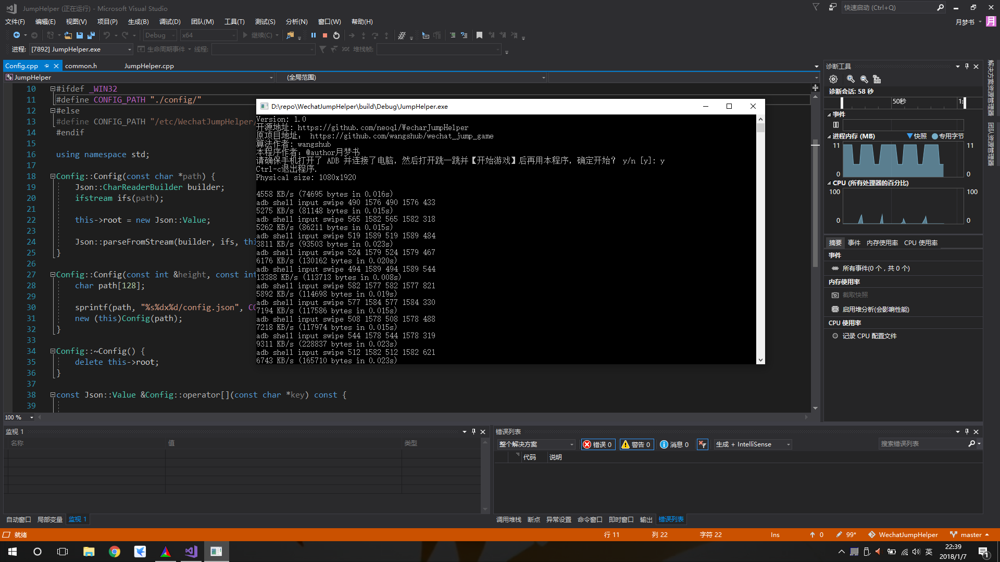

# JumpHelper

微信小游戏《跳一跳》作弊工具。(仅供学习交流使用，不得用于非法用途)

## 运行截图


Linux下运行



Windows下运行



## 安装

### Windows

下载 [`JumpHelper-windows-1.0.zip`](https://github.com/neoql/WechatJumpHelper/releases/download/1.0/JumpHelper-windows-1.0.zip) 并解压即可

### Linux

```
$ mkdir build && cd build
$ cmake ..
$ make
$ sudo make install
```

## 依赖

* [OpenCV](https://github.com/opencv/opencv)

* [JsonCpp](https://github.com/open-source-parsers/jsoncpp)

* ADB调试工具

## 使用方式

### Windows

解压 [`JumpHelper-windows-1.0.zip`](https://github.com/neoql/WechatJumpHelper/releases/download/1.0/JumpHelper-windows-1.0.zip) 后进入文件夹，双击 `JumpHelper.exe` 即可运行。

### Linux

```
$ JumpHelper
```

## 参考项目

|项目|作者|
|----|----|
|[教你用 Python 来玩微信跳一跳](https://github.com/wangshub/wechat_jump_game)|[wangshub](https://github.com/wangshub)|
